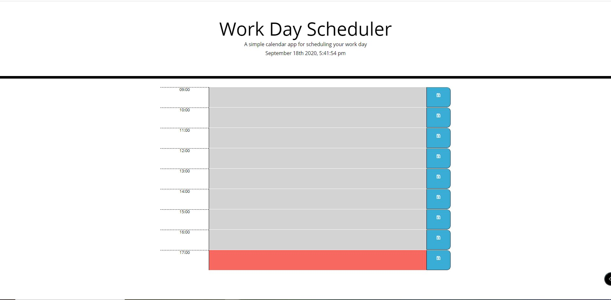

    Link to Github repo:
    Link to the browser:

Week 3 HW#2 Activity Planner

The overall scope of this project to enhance students skill in using the jQuery application to build a simple activity planner. This HW has to be dynamically updated HTML and CSS using the jQuery file. It means all the HTML elements have to be built within the Javascript file. In doing this HW, the steps that I took to make this HW from the start to the end were listed as below:
-   To start, copy the HTML and CSS files provided by the instructor. Then, make a new JS file where you want to store your codes.
-   Use Moment.js to give you the current dates and times to help you determine the timeblocks elements
-   Create the timeblocks using the jQuery starts at 9AM until 5PM
-   The planner itself has to include 3 elements, which are the time, textarea, and the save button
-   The textarea value has to be stored inside the localstorage, so whenever the user refresh the page, the value will still exist until the user decided to delete it

Screenshot of the HW will be listed as below:
   